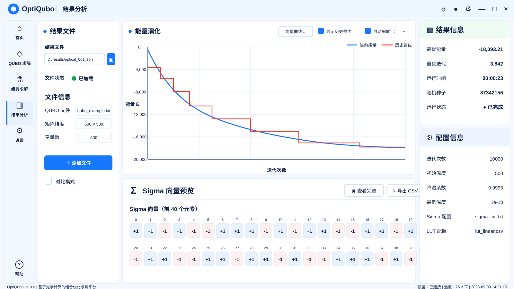

# OptiQubo 结果分析——光学 QUBO 结果

## 界面预览



## 1. 页面定位

该模式用于读取并查看单个光学 QUBO 求解结果文件。

## 2. 全局导航

左侧一级菜单：

```text
首页
QUBO 求解
经典求解
结果分析  ← 当前高亮
设置
```

底部保留“帮助”。

## 3. 页面布局

\[
\boxed{\text{左：结果文件与文件信息}}
\quad
\boxed{\text{中：能量演化与 Sigma 向量}}
\quad
\boxed{\text{右：结果信息与配置}}
\]

## 4. 左侧结果文件区

控件与信息：

- 结果文件路径；
- 文件选择按钮；
- 文件加载状态；
- QUBO 文件名；
- 矩阵维度；
- 变量数；
- 添加文件；
- 对比模式复选框。

结果文件路径与原始 QUBO 文件必须分开显示。例如：

```text
结果文件：D:/results/optical_001.json
QUBO 文件：qubo_example.txt
```

## 5. 中间能量演化

显示：

- 当前能量；
- 历史最优能量。

横轴：

```text
迭代次数
```

纵轴：

```text
能量 E
```

## 6. Sigma 向量预览

该区域必须与经典结果和对比模式保持统一。Sigma 是一维向量，不使用矩阵或热力图形式。

标题：

```text
Sigma 向量预览
```

说明：

```text
Sigma 向量（前 40 个元素）
```

### 6.1 排布规则

非对比模式默认显示两行，每行元素数量保持为 20 个：

```text
第一行：索引 0 ～ 19
第二行：索引 20 ～ 39
```

这样既保持单行密度不变，又减少下半区域的大面积空白。

### 6.2 视觉规则

- `+1`：蓝色浅底卡片；
- `-1`：红色浅底卡片；
- 所有卡片等宽、等高；
- 索引位于卡片上方；
- 两行使用相同的左右边距和元素间距；
- 提供“查看完整”；
- 提供“导出 CSV”。

## 7. 右侧结果信息

显示：

```text
最优能量
最优迭代
运行时间
随机种子
运行状态
```

## 8. 右侧配置信息

显示：

```text
迭代次数
初始温度
降温系数
最低温度
Sigma 配置文件
LUT 配置文件
```

## 9. 禁止显示

不得显示：

```text
是否达到全局最优
是否达到最优解
达到最优：是 / 否
```
