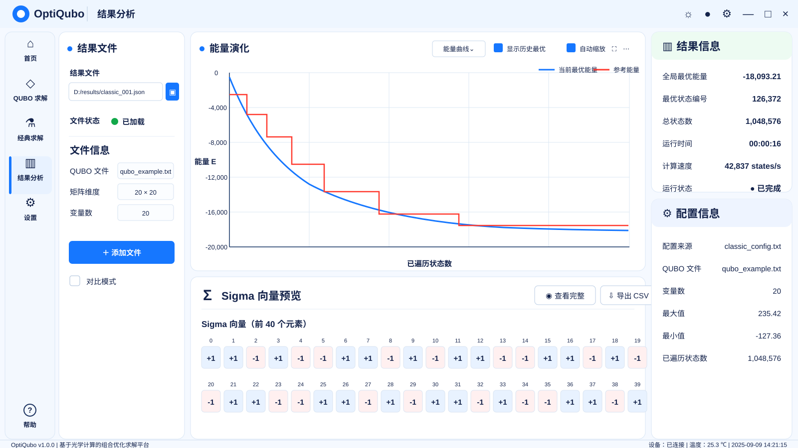

# OptiQubo 结果分析——经典求解结果

## 界面预览



## 1. 页面定位

该模式用于读取并查看单个经典求解结果文件。

页面不显示“暴力求解”“暴力穷举”或“求解类型”等字样。

## 2. 全局导航

左侧一级菜单：

```text
首页
QUBO 求解
经典求解
结果分析  ← 当前高亮
设置
```

底部保留“帮助”。

## 3. 页面布局

外层结构必须与光学结果分析一致：

\[
\boxed{\text{左：结果文件与文件信息}}
\quad
\boxed{\text{中：能量演化与 Sigma 向量}}
\quad
\boxed{\text{右：结果信息与配置}}
\]

## 4. 左侧结果文件区

显示：

- 结果文件路径；
- 文件加载状态；
- QUBO 文件；
- 矩阵维度；
- 变量数；
- 添加文件；
- 对比模式复选框。

不显示“求解类型”。

## 5. 中间能量演化

显示：

\[
E_{\mathrm{best}}(k)
=
\min_{1\le i\le k}E_i
\]

横轴：

```text
已遍历状态数
```

纵轴：

```text
能量 E
```

图例：

- 当前最优能量；
- 参考能量。

只有完整遍历结束后，当前最优能量才可以标记为“全局最优能量”。

## 6. Sigma 向量预览

该区域与光学结果完全一致。

标题：

```text
Sigma 向量预览
```

说明：

```text
Sigma 向量（前 40 个元素）
```

### 6.1 数据转换

如果结果文件中保存的是二进制向量：

\[
x_i\in\{0,1\}
\]

则先转换：

\[
\sigma_i=2x_i-1
\]

再统一显示为：

\[
\sigma_i\in\{-1,+1\}
\]

### 6.2 排布规则

非对比模式默认显示两行，每行保持 20 个元素：

```text
第一行：索引 0 ～ 19
第二行：索引 20 ～ 39
```

不得把 20 个元素拆成每行 10 个；单行数量保持不变，仅增加一行以充分利用垂直空间。

### 6.3 视觉规则

- `+1`：蓝色浅底卡片；
- `-1`：红色浅底卡片；
- 索引显示在卡片上方；
- 两行卡片尺寸、颜色、字号、左右边距和元素间距完全一致；
- 提供“查看完整”；
- 提供“导出 CSV”。

## 7. 右侧结果信息

显示：

```text
全局最优能量
最优状态编号
总状态数
运行时间
计算速度
运行状态
```

## 8. 右侧配置信息

显示：

```text
配置来源
QUBO 文件
变量数
最大值
最小值
已遍历状态数
```

## 9. 禁止显示

不得显示：

```text
暴力求解
暴力穷举
经典暴力
求解类型
是否达到全局最优
```
