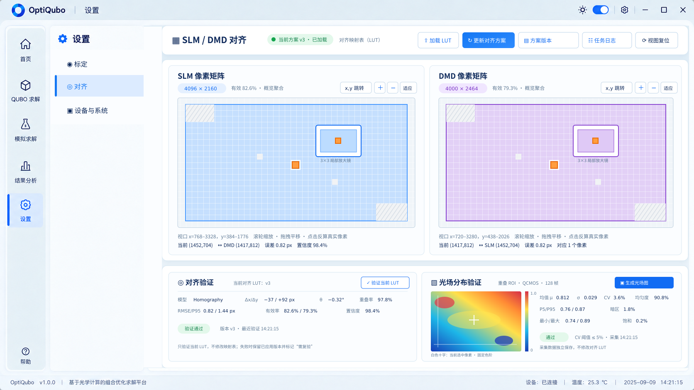

# 设置——对齐界面设计

## 1. 页面定位

“对齐”位于：

```text
设置 → 对齐
```

用于直观检查和更新 SLM 与 DMD 的像素映射关系，并独立验证叠加后的光场分布。页面默认读取已有 LUT；没有 LUT 时，所有像素均显示为无效的灰白状态。

全局顶部栏、底部状态栏、一级侧边栏和设置二级侧栏沿用设置页原始界面，不因本页面内容改变。



## 2. 设置二级导航

设置二级菜单顺序为：

```text
标定
对齐
设备与系统
```

当前页面高亮“对齐”。高亮背景只能位于二级菜单容器内部，不越过侧栏右边界；主内容区与侧栏之间保留原始留白。

## 3. 顶部操作区

顶部标题为“SLM / DMD 对齐”，右侧提供：

- `加载 LUT`：读取已有对齐查找表；
- `更新对齐方案`：根据当前标定结果生成并应用新 LUT；
- `方案版本`：显示当前已加载方案版本；
- `任务日志`：查看加载、更新和验证过程；
- `视图复位`：恢复两个矩阵的默认缩放、平移和选中状态。

页面不使用“加载方案”这一名称，统一称为“加载 LUT”。

## 4. 上部：像素映射工作区

上部为页面最大区域，左右并列显示两个可缩放、可平移的像素矩阵：

| 区域 | 内容 |
|---|---|
| 左侧 | SLM 像素矩阵，显示实际分辨率和有效像素； |
| 右侧 | DMD 像素矩阵，显示实际分辨率和有效像素； |
| 两图之间 | 不设置独立控制面板，避免压缩矩阵显示面积。 |

矩阵中的每个方格都可点击。点击 SLM 或 DMD 的有效像素后，另一侧对应映射像素同步高亮并短暂闪烁；当前选中像素使用橙色强调。无效像素保持灰白色，不参与映射。

矩阵底部显示：

- 当前视口坐标范围；
- 当前 SLM/DMD 像素坐标；
- 映射误差（px）；
- 匹配置信度；
- 缩放、平移和反向查找提示。

## 5. 下部：两个独立验证区域

对齐验证与光场分布验证必须分成两个独立卡片，不能混合为同一结果区。

### 5.1 对齐验证

该区域只验证当前 LUT，不修改映射表。显示：

- 模型：Homography；
- 当前 LUT 版本；
- \(\Delta x\)、\(\Delta y\)；
- 旋转角 \(\theta\)；
- 重叠率；
- RMSE / P95 重投影误差；
- SLM、DMD 有效率；
- 置信度；
- 最近验证时间。

控件为 `验证当前 LUT`。验证结果使用三态提示：通过、需复验、失败。验证失败时保留当前已应用 LUT，不自动覆盖旧方案。

### 5.2 光场分布验证

该区域独立检查 SLM+DMD 重叠后的光场，不改变 LUT。提供 `生成光场图`，并显示较小的光场热图和具体统计信息：

- 均值、标准差；
- 变异系数 CV；
- 均匀度；
- P5 / P95；
- 最小值 / 最大值；
- 暗区比例；
- 饱和比例；
- 采集帧数和采集时间；
- 当前 ROI / QCMOS 数据源。

光场结果单独给出通过、需复验或失败状态，并注明“采集数据独立保存，不修改对齐 LUT”。

## 6. 状态与数据规则

1. 没有 LUT 时，两个矩阵全部显示为灰白无效状态；对齐验证和光场统计显示“暂无数据”。
2. 加载 LUT 后，仅 LUT 中标记为有效的像素着色，其余像素继续保持灰白。
3. 更新对齐方案成功后生成新版本，并保留上一版本用于回退。
4. 选择像素只改变可视化选中状态，不直接修改 LUT。
5. 对齐验证和光场分布验证可以分别执行，任一项失败不覆盖另一项结果。
6. 所有阈值、版本和时间戳均在任务日志中记录。

## 7. 推荐数据结构

```json
{
  "version": "v3",
  "model": "homography",
  "valid_slm_ratio": 0.826,
  "valid_dmd_ratio": 0.793,
  "offset_px": {"x": -37, "y": 92},
  "rotation_deg": -0.32,
  "overlap_ratio": 0.978,
  "rmse_px": 0.82,
  "p95_px": 1.44,
  "confidence": 0.984,
  "light_field": {
    "mean": 0.812,
    "std": 0.029,
    "cv": 0.036,
    "uniformity": 0.908,
    "p5": 0.76,
    "p95": 0.87,
    "dark_ratio": 0.018,
    "saturation_ratio": 0.002
  }
}
```

